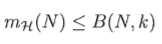
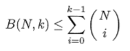

# Sauer-Lemma-Verification
Verifying Sauer's Lemma for a Convex hypothesis set

## Convex Sets
The hypothesis set considered here is a convex set. This set contains all hypothesis in 2D space h:R^2 -> {-1, +1}, that are positive inside some convex set and negative elsewhere.

To create a convex set N points are randomly chosen along the perimeter of a random circle. We consider any dichotomy of these points, assigning arbitrary pattern of +/-1's.

### Observation
If we connect the +1 points with a polygon, the hypothesis made up of the closed interior of the polygon(which will always be convex) agrees with the dichotomy of all N points.

## Theory
For a convex set the growth function, i.e. m(N) = 2^N. Growth function only has  to do with the upper bound of m(N) for an hypothesis set, for a convex set we can easily create this upper bound by taking the N points along the perimeter of a circle.

Since the m(N) = 2^N, this means that any set of N points can be shattered by our hypothesis set H(convex set). This means that the breakpoint = k = infinity and the VC dimension = d = infinity.

If B(N,k) is the maximum number of dichotomies on N points such that no subset of size k of the N points can be shattered by these dichotomies, then,



Now, according to Sauer's lemma,



Thus,


For the case of convex set, since k -> infinity, we can take the upper limit of the summation to be N instead of k - 1
## Running the code
* Give the following command in the MATLAB command terminal
  ```MATLAB
  sauermain.m
  ```
* Enter the value of N(number of points to be taken)

## Observation
* RHS is computed and displayed using,

  

* All possible dichotomies plotted as shown below,


## Result
We can see that the total number of creatable dichotomies for any N equals 2^N, i.e. the N points are shattered no matter what N we take.

The RHS of Sauer's lemma when computed for this case, keeping the upper limit to be N(since k = infinity for convex set) comes out to be equal to 2^N for all cases.

Thus LHS <= RHS(LHS = RHS in this case) is true, hence Sauer's lemma is verified for the convex hypothesis set.
